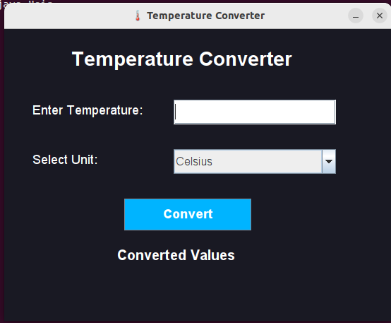
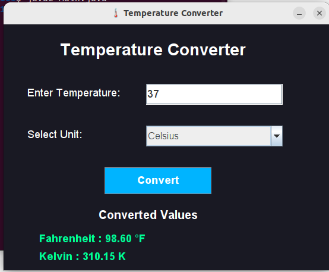

# 🌡️ Temperature Converter

## 📌 Overview
This project is a **Java GUI-based Temperature Converter** developed as part of my **Software Development Internship at SkillCraft Technology**.

The application allows users to enter a temperature value in one unit and instantly convert it into the other temperature units with accurate results through a simple and interactive interface.

---

## ✨ Features
✔ Convert between **Celsius (°C), Fahrenheit (°F), and Kelvin (K)**  
✔ Clean and user-friendly **GUI**  
✔ Modern **dark theme interface**  
✔ Instant and accurate conversion  
✔ Input validation for better usability  

---

## 🛠️ Technologies Used
- Java  
- Swing (GUI)  
- Object-Oriented Programming (OOP)  

---

## 🚀 How to Run
1. Clone this repository  
2. Open in any Java IDE (**Eclipse / IntelliJ / VS Code**)  
3. Compile the program:

```bash
javac Main.java
```

4. Run the program:

```bash
java Main
```

---

## 📂 Project Structure
```bash
SCT_SD_1/
│── Main.java
│── README.md
└── Screenshots/
    ├── Homescreen.png
    ├── output1.png
    ├── output2.png
    ├── output3.png
    └── output4.jpeg
```

---

## 📷 Application Preview

### Home Screen


### Sample Output


---

## 🎯 Learning Outcomes
Through this project, I improved my understanding of:
- Java GUI Development  
- Event Handling  
- OOP Concepts  
- User Interface Design  

---

⭐ Developed by **Neelamrutha Kommireddy** as part of the **SkillCraft Technology Internship**
